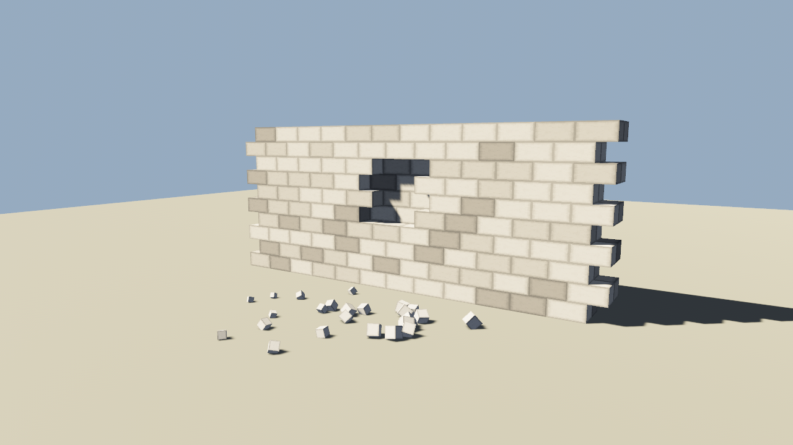

# destructible_wall · 可破坏砖墙

**Binary**: `cargo run --release --bin destructible_wall`

## 效果预览

左键点砖 → 打掉砖（`--demo` 模式自动打一个 2×4 的洞）：



数据层验证输出（演示退出前会打印）：

```
层 7  ▓▓▓▓▓··▓▓▓▓▓
层 6  ▓▓▓▓▓··▓▓▓▓▓
层 5  ▓▓▓▓▓··▓▓▓▓▓
层 4  ▓▓▓▓▓··▓▓▓▓▓
剩余砖块: 232/240
```

## 它解决什么问题

做"地图可破坏"时，常见的误区是：
1. 直接堆 240 个独立 Mesh，draw call 爆炸 → 用 **Chunk 合并网格**（一次合并、只画可见面）
2. 破坏逻辑和鼠标输入写死在一起 → 用 **消息解耦**：`BlockPunched` 事件统一入口，鼠标/演示都发它
3. 破坏后空荡荡 → 加 **碎砖手写物理**（gravity + bounce + friction，速度耗尽后冻结成静态碎砖堆）

这些就是你可以直接抄去自己项目里的关键点。

## 核心文件

| 文件 | 负责 |
|---|---|
| [`src/cases/destructible_wall.rs`](../../src/cases/destructible_wall.rs) | App 装配；`setup`、`punch_on_click`、`apply_punch`、`spawn_debris`、`update_debris`、`demo_fire`、`demo_shot`、`demo_exit` 系统 |
| [`src/cases/wall/mod.rs`](../../src/cases/wall/mod.rs) | 体素数据层（`WallData`）+ 砖块坐标转换 + Chunk 网格生成（`WallChunk::build`） |
| [`src/tex.rs`](../../src/tex.rs) | 程序化砖墙贴图（带灰缝边框，避免"缩放砖块留缝导致透光"） |
| [`src/demo.rs`](../../src/demo.rs) | `DemoDriver` 统一脚手架；`request_screenshot` / `request_exit` 封装 |
| [`src/common.rs`](../../src/common.rs) | 灯光、相机、地面、材质、合并网格工具 |

## 结构导图（照着抄到你项目）

```
输入（鼠标 / 演示定时器）
    │
    ▼
  BlockPunched(cx, cy, cz)  ← 统一事件入口
    │
    ▼
 apply_punch 系统：
  1. WallData[cx][cy][cz] = false   ← 数据层才是真相
  2. 重建受影响的 WallChunk mesh
  3. 生成 1~3 块 Debris 实体（带初速度）
    │
    ▼
 update_debris 系统每帧处理：
  1. 重力 + 空气阻力
  2. 落地弹跳 + 摩擦
  3. 速度 < epsilon 时 free → 静态
```

## 运行方式

```bash
# 玩家交互
cargo run --release --bin destructible_wall
# WASD 移动，鼠标视角，左键点砖破坏

# 演示模式（自动打洞 + 截图 + 退出）
cargo run --release --bin destructible_wall -- --demo
# → shots/destructible_wall_shot.png
```

## 可以直接改的 5 个参数（调参看效果）

1. `WallData::new` 的 `WALL_W/H/T`（墙宽/高/厚度）
2. `apply_punch` 里 `(3..=5).choose`（生成碎砖块数）
3. `update_debris` 里 `G` / `BOUNCE` / `FRICTION`
4. `tex::brick_texture` 的 `BORDER` / `R_MIN` / `R_MAX`
5. 相机初始位置：`spawn_default_camera` 调用传 `eye` 覆盖默认
