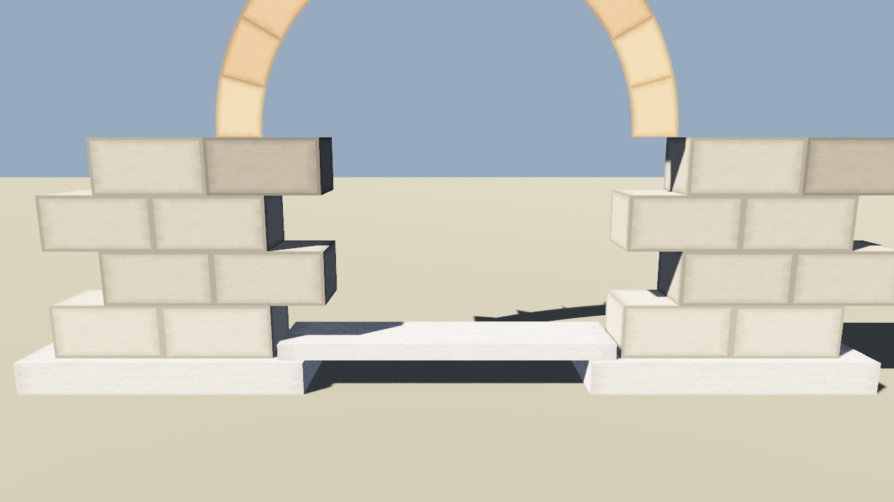

# semicircular_arch · 半圆拱门

**Binary**: `cargo run --release --bin semicircular_arch`

## 效果预览

左支座 2×4 砖 + 墩基，12 块 ArchBrick（每块 15°）拼成 180° 半圆拱圈，右支座对称，中间一道水泥门槛。



## 组成拆解

| 部件 | 元素 | 尺寸/数量 | 坐标/朝向 |
|---|---|---|---|
| 左右墩基 | `CementBlock`（2 条） | 2.60 宽 × 0.30 高 × 0.85 厚 | 中心 X=±2.6，Y=0.15，Z=0 |
| 门槛 | `CementBlock`（1 条） | 3.88 宽 × 0.15 高 × 0.70 厚 | 正中间，Y=0.375 |
| 左右支座砖墩 | `Brick` 错缝砌法 | 每侧 2 列 × 4 皮（共 16 块） | 内边对齐拱脚 X=±1.6，基础顶 Y=0.30 起砌 |
| 拱圈 | `ArchBrick` | 12 块，每块 15°，R=1.6/2.0 | 圆心 (0, 2.3, 0)，段角 k = -90°+7.5° → +90°-7.5°，旋转 `R_y(yaw) · R_x(-π/2)` 把 XZ 弯转投到 XY 平面 |

## 拱砖拼装的关键几何（做复杂曲面结构时照着抄）

1. **ArchBrick 的原生几何**：由 `arch_brick_mesh(r, thick, arc, h, slices)` 生成，所有顶点在 **XZ 平面**弯曲：
   - 顶点 `(r·sinθ, y, r·cosθ)`，θ ∈ [-arc/2, +arc/2]，θ=0 指向 +Z（正前方）。
2. **把它"立起来"当门拱**：在 `Transform` 上再叠一个 `rotate_x(-π/2)`（绕 +X 轴旋 -90°），点坐标变成 X-Y 平面内的圆弧：
   - `(r·sin(θ+yaw), r·cos(θ+yaw), 0)` —— 顶在 (0, +R)、脚在 (±R, 0)，正好是正视角下的半圆门。
3. **拼 N 段**：`one_arc = π/N`，第 k 块 `yaw = -π/2 + (k+0.5)·one_arc`，绕 +Y 旋转后再按第二步翻转。

对应在代码里就是三行（见 [semicircular_arch.rs L148-L151](../../src/cases/semicircular_arch.rs#L148-L151)）：

```rust
let yaw = -FRAC_PI_2 + (k as f32 + 0.5) * one_arc;
let mut t = Transform::from_translation(Vec3::new(0.0, center_y, 0.0));
t.rotate_y(yaw);
t.rotate_x(-FRAC_PI_2);
```

## 延伸练习

- 拱顶加一块拱心石（拱顶最上面的一块楔形石更大更红）：在 k=6（最顶那块）上单独加宽 arc_rad + 改 palette。
- 整圈圆柱：把 one_arc = `TAU / N`，yaw 从 0 扫到 TAU，就是完整圆柱（亭子柱子）。
- **case 06：罗马水道桥**：连续 5 个半圆拱排成一排。

## 运行方式

```bash
cargo run --release --bin semicircular_arch
cargo run --release --bin semicircular_arch -- --demo
# → 生成 shots/semicircular_arch_shot.png
```
