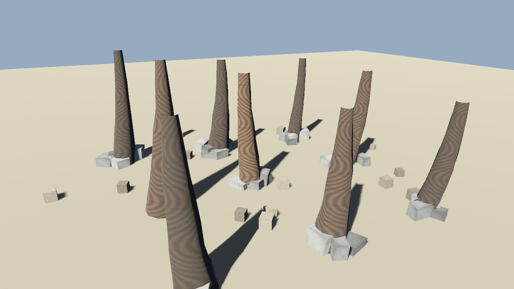

# small_grove · 小树林 3×3

**Binary**: `cargo run --release --bin small_grove`

## 效果预览

3 行 × 3 列 = 9 棵歪曲圆柱树干，每棵脚下 2~5 块不规则石头做树根乱石，全场景再撒 22 块碎砖做地表杂物。每棵树高度/直径/锥度/弯曲方向/弯曲量全不同，基于 `hash2` 确定性随机（所以每次运行都一模一样，不会漂移）。



## 每棵树的独立参数（用 `rng_range = lo + (hi-lo)·hash2(seed, slot)` 生成）

| 参数 | 范围 | 说明 |
|---|---|---|
| 高度 h | 2.6 ~ 3.9 m | 小树 ~ 乔木 |
| 底部半径 r0 | 0.28 ~ 0.44 m | 底径 0.56 ~ 0.88 m |
| 顶部半径 r1 | 0.10 ~ 0.16 m | 顶径 0.20 ~ 0.32 m，锥度明显 |
| 弯曲方向 θ | -40° ~ +160° | 避免所有树弯一个方向，树林更自然 |
| 弯曲幅度 | 0.15 ~ 0.48 m | 抛物线 `t·(2-t)`：根部直立、顶部偏到最大 |
| 径向扰动 | 半径 ±14% | 让"圆柱"有树皮凹凸，避免塑料感 |

所有 mesh 都走 `curved_trunk_mesh(h, r0, r1, 18, 7, bend, seed)`（详见 [elements.rs](../../src/elements.rs) 自由函数 `curved_trunk_mesh`）。

## 做更大的树林（不重新写 case）

把 setup 里 ROWS/COLS 常量改大（比如 6×6=36 棵），步长 STEP_X / STEP_Z 还是 3.0 就不会挤；或写一个独立函数：

```rust
fn random_tree(i: i32) -> Mesh {
    let seed = i * 13;
    let h  = rng_range(seed, 1, 2.6, 3.9);
    let r0 = rng_range(seed, 2, 0.28, 0.44);
    let r1 = rng_range(seed, 3, 0.10, 0.16);
    let theta = rng_range(seed, 4, (-40_f32).to_radians(), 160_f32.to_radians());
    let mag   = rng_range(seed, 5, 0.15, 0.48);
    curved_trunk_mesh(h, r0, r1, 18, 7, Vec2::new(theta.cos()*mag, theta.sin()*mag), seed)
}
```

## --demo 统计输出

```
· 网格布局：3 行 × 3 列，XZ 抖动 ±0.30 m，共 树 9 棵
· 树根乱石：共 37 块 IrregularRock（每棵树下 2~5 块，随机尺寸/旋转/颜色）
· 地表碎物：共 22 块 DebrisPiece（整个场景 12×12 m 内随机撒）
· 单棵树参数范围：高 2.6~3.9 m，底径 0.56~0.88 m，顶径 0.20~0.32 m，弯曲量 0.15~0.48 m
```

## 运行方式

```bash
cargo run --release --bin small_grove
cargo run --release --bin small_grove -- --demo
# → 生成 shots/small_grove_shot.png
```
